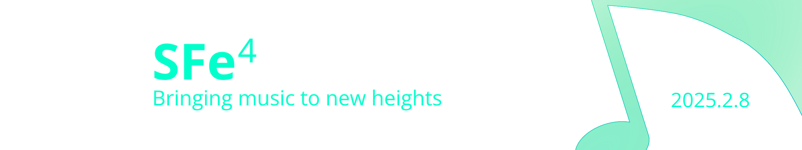

This is the official repository for the SFe specification.

The specification can be accessed at:

https://sfe-team-was-taken.github.io/SFe/

### What is SFe?

Like many members of the soundfont community, we are tired of the limitations of the ancient SoundFont format. So, in 2020, we launched the SFe (SF-enhanced) project, to research backwards-compatible improvements and updates to the format.

To do this, we looked at many features that soundfont creators have requested, and are working on incorporating them into the SFe format.

In 2025, the first version of SFe, version 4.0, launches. We hope that you enjoy it.

### What are the goals of SFe?

The goals of the SFe project are to:

- Unite proprietary extensions to the SoundFont format
- Add the most requested features by soundfont developers
- Enable sample libraries that we could never have imagined 
- Create a viable competitor to commercial sample library formats (Kontakt, etc.)
- Allow intercompatibility between other open source sample library formats (such as SFZ)

### Why does the specification not include everything?

To make it more concise, we only highlight the differences between the SFe specification and the legacy SoundFont specification (`SFSPEC24.PDF`). If you want to develop for SFe, we recommend that you also read the legacy SF2.04 specification (`SFSPEC24.PDF`).

### How can I contribute?

Please read [contributing to SFe](contributing.md).
