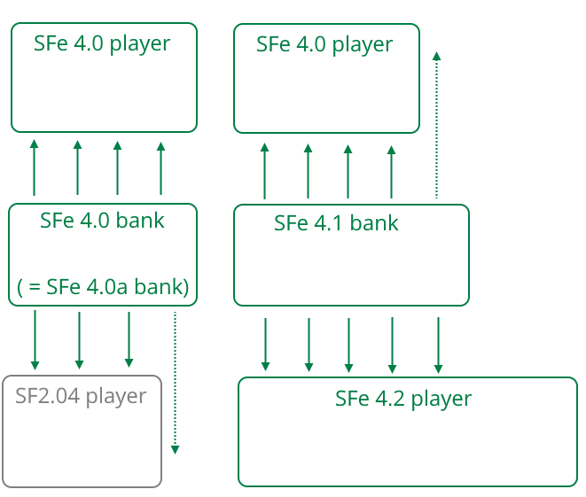
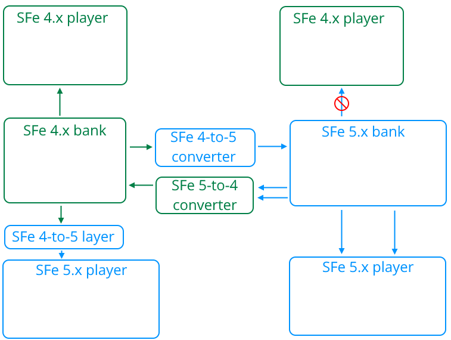
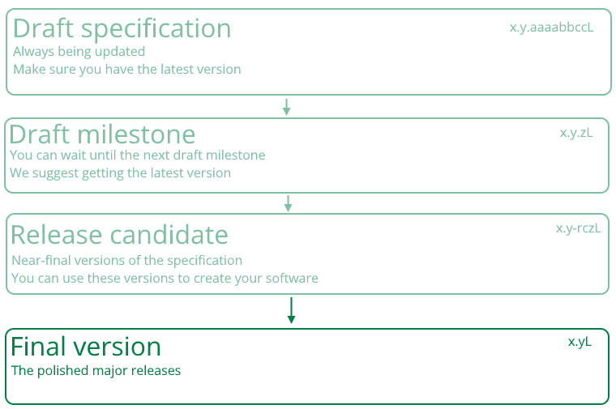

# Section 3: Versioning and updates

## 3.1 Specification Versioning

Final specifications have version numbers in the format x.y.z, where x, y and z are numbers:

- x is incremented when a change in the SFe format is made in a way that makes the resulting files incompatible with the previous version.
- y is incremented when there are new features added to the SFe format.
- SFe should not skip "y" versions.
- z is incremented when there are small changes made to the specification.
- Release candidates have very similar version numbers to final specifications, but include "rc" between y and z.
- An example of a final specification version would be 4.0.22.

Figure 1: SFe 4.x versions are compatible with legacy players but with reduced sound quality. No changes are made to actual file structure in "L" versions. Later "y" versions are compatible with earlier players but with reduced sound quality.

Figure 2: SFe "x" versions are not compatible with each other, but can be converted, resulting in reduced sound quality. Compatibility layers can be added to newer players to use older banks. It is also possible to upgrade banks to newer versions.

Draft specification milestones have version numbers in the format `x.ydz.a`, where `x, y, z` and `a` are numbers and d and u are the letter "d". In this case, the versioning works similarly to a final specification, but with these changes:

- `z` is incremented when the draft undergoes a larger change, or large updates are made to the software.
- `a` is incremented when there are small changes, but only when pointed out by others. The first version will not include a or a "." in its version number.
- An example of a draft specification version would be 4.1d1.

During the development of specifications, version numbers will be in the format `x.y.aaaabbccL`, where x, y, z, a, b and c are numbers, and L is a letter. The versioning is similar to final specifications and milestone drafts, but `aaaabbcc` is the day in which the specification was updated, and L is incremented when updated.

Only final specifications are included in the changelog in section 1.2.

Figure 3: The SFe development process.

## 3.2 Future improvements

SFe is designed for future improvements.

- These will be done in a more liberal way than the conservative manner of the SoundFont® 2 updates that E-mu has done.
- SFe is not affected by limitations created by the EMU8000 sound processor and Sound Blaster® cards, and therefore will have more improvements.
- Additionally, starting from SFe 5, SFe won't be affected by limitations created by legacy SF players.
- To avoid over-stress of developers of the SFe Team, as well as SFe instrument banks, features will be spread out across versions, and similar features will arrive at the same time.

Here are a few things that are planned for SFe:

- Polyphone 3 will be the first program that supports SFe. It will use it by default with legacy SF being an option. (Polyphone 2.5.x seems to be planned as an LTS release for legacy SF.)
- Developers of Bassmidi-based programs have already provided feedback, and negotiations with more SF program developers such as FluidSynth will start soon.
- For SFe 4.1, support for the `PNMM` sub-chunk will also be included, as well as Markdown support for `ICMT`.
- A MIDI lyrics specification for MIDI players, along with Spessasus/Falcosoft RMIDI support, will become available in SFe 4.2. `xmod` support will be added to expand the 16-bit generators to 32-bit.
- We will negotiate with the Synthfont author Kenneth Rundt about getting the Synthfont Custom Features added for SFe 4.2. Care has been taken to ensure that SFe parameter usage does not conflict with SFCF.

## 3.3 Long term support of SFe 4

SFe 4 is a "long-term support" version, and will get feature updates along with later versions such as SFe 5. While this is the case, some features are structurally incompatible with legacy SF2.04, and will not be available in SFe 5.

If an earlier major version of SFe is the main version used for a longer time than expected, then it can be declared as another LTS version. Such a LTS version will be declared in this section.
