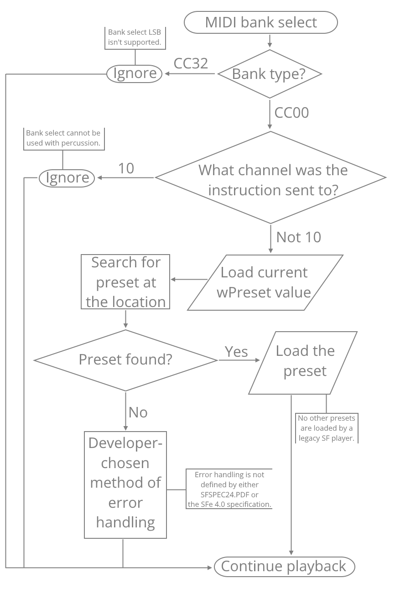

# Section 5: SFe file format structure

## 5.1 File format extensions

The file format extension to use for SFe files is generally `.sf4`:

- `.sf2` is avoided because SFe files are *not* SoundFonts, but simply banks that use formatting that is very similar to legacy SF2.04.
- `.sf3` is avoided because some Werner SF3 bank players may not support SFe features.

Despite `.sf4` also being used by cognitone-formatted banks, these banks never existed due to a (fatal bug)[https://github.com/cognitone/sf2convert/issues/1] in cognitone's sf2convert program.

The presence of a legacy SF file extension such as `.sf2` or `.sf3` does not necessarily denote a legacy SF bank! SFe-compatible programs are expected to parse the `ifil` value and `ISFe-list` sub-chunk to properly load the bank, regardless of the extension.

The file type should be referred to as `SFe bank` and should *not* be referred to as `SoundFont` or anything containing `SoundFont`. `SFSPEC24.PDF` states that files with additional chunks don't conform to the legacy SF2.04 standard.

SFe currently does not use a MIME type.

## 5.2 General RIFF-type format structures (Update 17)

RIFF-type formats are the file format used in legacy SF2.04, Werner SF3 and SFe standards. There are a few different RIFF-type format structures:

- RIFF is the basic version with 32-bit chunk headers, and is used in legacy SF2.04 and Werner SF3.
- RIFS is a simple extension to RIFF to allow 64-bit chunk headers, and is simpler than RIFF64. It has these changes from RIFF:
    - Initial FourCC is `RIFS` instead of `RIFF`.
    - 8 byte chunk size instead of 4 byte.
- Both RIFF and RIFS are little-endian formats. (Update 17)

RIFF-type formats are created in building blocks known as "chunks."

Chunks are defined using this structure:

- `ckID`: type of data in chunk, equal to a unique 4-character code (FourCC), listed above.
- `ckSize`: size of chunk, 4 bytes in RIFF and 8 bytes in RIFS (Update 17)
- `ckDATA[ckSize]`: the data inside the chunks, including pad bytes.

Chunks can be further divided into "sub-chunks."

Orders of chunks in all SFe banks are strictly defined, as in legacy SF2.04, and should be kept to, except for TSC mode.

## 5.3 Chunk header types

In SFe, there are different chunk header types that are used in the format. These correspond to different RIFF-type formats. Currently, there are two defined chunk header types:

- 32-bit static
    - This is the same as legacy SF
    - This corresponds to RIFF.
    - The FourCC used is `RIFF`.
- 64-bit static (Update 17)
    - This corresponds to RIFS.
    - The FourCC used is `RIFS`.
    - To prevent loading by incompatible players, the `sfbk` fourcc is replaced with `sfen` (**SF-en**hanced)

Future versions of SFe may define different chunk header types.


Figure 4: 32-bit static versus 64-bit static headers.

## 5.4 RIFF error checking features

RIFF-type formats have error checking features about:

- The size of the file
- The length of the chunks
- The length of the sub-chunks

Using this information, it is possible to check for damage to an SF(e) file.

## 5.5 Structure of the SFe 4 file format

### 5.5.1 SFe 4 file format structure outline

An SFe 4 file consists of:

- `RIFF` chunk (main chunk) - this changes depending on the chunk header type to be used.
    - `sfbk` ascii string - use `sfen` with 64-bit chunk headers
    - `LIST`
        - `INFO` ascii string
        - Sub-chunks inside `INFO-list` in legacy SF2.04 - `ifil`, `isng`, etc.
        - `LIST`
            - `ISFe` ascii string
            - Chunks listed in section 5.5.2
    - `LIST`
        - `sdta` ascii string
        - Sub-chunks inside `sdta-list` in legacy SF2.04 - `smpl`, `sm24`
    - `LIST`
        - `pdta` ascii string
        - Sub-chunks inside `pdta-list` in legacy SF2.04

Only SFe-specific chunks are listed for brevity. In this section, assume that any non-listed chunk is identical to SF2.04.


Figure 5: Legacy SF2.04 vs SFe 4.0 structures.

### 5.5.2 ISFe-list information

The `ISFe-list` sub-chunk includes many different sub-chunks to show information about SFe-specific features. Generally, we use the `ISFe-list` sub-chunk to make it clearer that this kind of information is SFe-specific.

Due to possible compatibility constraints, the `ISFe-list` sub-chunk is found inside the `INFO-list` sub-chunk, rather than as a fourth RIFF chunk. At least a few legacy sound cards (notably the SB X-Fi) do not error out on the inclusion of a fourth separate chunk. Officially, according to `SFSPEC24.PDF`, additional sub-chunks mean that an SFe file is not conformant to the legacy SF2.04 standard.

The `ISFe-list` sub-chunk currently contains these sub-chunks as of version 4.0:

- `SFty` chunk (UTF-8 string)
- `SFvx` chunk (46 bytes)
    - `wSFeSpecMajorVersion` (`WORD`)
    - `wSFeSpecMinorVersion` (`WORD`)
    - `achSFeSpecType[20]` (`CHAR`)
    - `wSFeDraftMilestone` (`WORD`)
    - `achSFeFullVersion[20]` (`CHAR`)
- `flag` chunk (multiple of 6 bytes)
    - `byBranch` (`BYTE`)
    - `byLeaf` (`BYTE`)
    - `dwFlags` (`DWORD`)

### 5.5.3 Changed and removed chunks

In the `pdta-list` sub-chunk, the `wBank` chunk has been replaced by `byBankMSB` and `byBankLSB`. These are functionally the same, but expressed in a different way to make the specification more readable.

### 5.5.4 String encoding

For most string fields, the encoding to use is now UTF-8 instead of ASCII. Mojibake may result on legacy SF players when using characters unsupported by ASCII. Because some characters use multiple bytes in UTF-8, you may not be able to use as many multibyte characters compared to single-byte characters.

This applies to the `isng`, `INAM`, `irom`, `ICRD`, `IENG`, `IPRD`, `ICOP`, `ICMT`, `ISFT` chunks from legacy SF2.04, as well as the `achPresetName` (`PHDR`), `achInstrumentName` (`INST`) and `achSampleName` (`SHDR`) fields.

## 5.6 INFO-list sub-chunk

### 5.6.1 ifil sub-chunk

The value of the `ifil` sub-chunk is equal to `2.1024` or `3.1024` when using a 32-bit header, and `4.0` when using a 64-bit header. `2.1024` and `3.1024` are interchangeable. (Update 20)

The size must be exactly four bytes. Reject files with an `ifil` sub-chunk that isn't four bytes as Structurally Unsound.

If the `ifil` sub-chunk is missing, either:

- Assume version `2.1024`, `3.1024` or `4.0`. (Update 8)
- Reject the file as Structurally Unsound.

### 5.6.2 Versioning rules

In SFe 4.0, new versioning rules are used to replace the old ones.

The value of `wMajor` increases every time a change is made to the format that makes it incompatible with existing players.

- There will be at least 6 months between the first draft milestone of a new `wMajor` version and the release of the final specification.
- Older `wMajor` versions must be supported, either directly or via translation to the latest version.
- We strive to minimize the number of these updates whenever possible in favor of updates that are backward compatible.

The value of `wMinor` increases every time a change is made to the `SFvx` sub-chunk while retaining backwards compatibility.

- These updates generally have only one or two draft milestones before the final specification releases.
- Feature updates in these versions are smaller.

The specification type used is found in the `ISFe-list` sub-chunk.

### 5.6.3 Specification versions to ifil values

| wSFeSpecMajorVersion | wSFeSpecMinorVersion | ifil (wMajor)                               | ifil (wMinor)                             |
|----------------------|----------------------|---------------------------------------------|-------------------------------------------|
| 4                    | 0                    | 2 or 3 (32-bit header)<br>4 (64-bit header) | 1024 (32-bit header)<br>0 (64-bit header) |

(Changed for Update 8)

### 5.6.4 isng sub-chunk

A new default isng sub-chunk value is used in SFe: `SFe 4`.

- SFe 4.0 players should recognize this and remove the default velocity related filter used in legacy SF2.04.
- In the case of a missing isng chunk, files with an ifil sub-chunk with `wMajor` = 2 or 3 and `wMinor` >= `1024`, or `wMajor` >= 4, assume an isng sub-chunk value of `SFe 4`. Don't assume `EMU8000`.

Additionally, UTF-8 is now used instead of ASCII, and the length limit is removed.

- The `isng` sub-chunk contains a UTF-8 string of any length.
- Example of value: `SFe 4` (with appropriate zero bytes).

Reject anything not terminated with a zero byte, and assume the value `SFe 4`. Do NOT assume `EMU8000` by default.

### 5.6.5 List of sound engines

#### Creative/E-mu

|                       |                |                              |               |                 |
|-----------------------|----------------|------------------------------|---------------|-----------------|
| **Sound engine name** | **isng value** | **Creative/E-mu SF version** | **Bit depth** | **Sound cards** |
| EMU8000               | `EMU8000`      | 1.0, 1.5, 2.00               | 16 bit        | AWE32, AWE64    |
| EMU10K1               | `E-mu 10K1`    | 2.01                         | 16 bit        | SB Live!        |
| EMU10K2               | `E-mu 10K2`    | 2.01                         | 16 bit        | SB Audigy       |
| EMU20K1, EMU20K2      | `X-Fi`         | 2.04                         | 24 bit        | SB X-Fi         |

#### SFe

|                       |                |                 |                                                   |
|-----------------------|----------------|-----------------|---------------------------------------------------|
| **Sound engine name** | **isng value** | **SFe version** | **Bit depth**                                     |
| SFe 4                 | `SFe 4`        | 4.0             | 8 bit, 16 bit, 24 bit, 32 bit, 64 bit (Update 11) |

### 5.6.6 ICRD sub-chunk

To ease the creation of library management systems that are compatible with multiple languages, the naming convention for the `ICRD` sub-chunk has been changed.

The value of `ICRD` must now be compliant with the ISO-8601 standard. There are two valid formats:

- Date only: for example `2025-02-08`

- Date and time: for example `2025-02-08T02:28:00Z`

Library management systems should be able to read the value of the `ICRD` sub-chunk and show the date (and time if applicable) in the correct language in a field that can be sorted.

If the value of the `ICRD` sub-chunk is missing or not in any of the above two valid formats, the program may either:

- attempt to parse the value (if the chunk is present)
- ignore the value (if present) and show an "unknown" error on the date (and time) field
- overwrite the value with the current date (and time) if the program is an editor

The program must NOT reject a file with a missing or invalid `ICRD` sub-chunk as Structurally Unsound.

### 5.6.7 INAM, IENG, IPRD, ICOP, ICMT and ISFT sub-chunks

These sub-chunks are mostly the same as in legacy SF2.04, but UTF-8 is now used instead of ASCII, and the length limit is removed.

Reject anything not terminated with a zero byte. Do NOT reject the file as Structurally Unsound.

### 5.6.8 irom and iver sub-chunks

Read the legacy SF2.04 specification for info on how to use ROM samples.

The ROM emulator should be implemented in SFe programs.

### 5.6.9 SFty sub-chunk

The `SFty` sub-chunk is nested inside the `ISFe-list` sub-chunk. It is required and contains a case-sensitive UTF-8 string with even length identifying the type of format used in SFe. Its value is used by SFe-compatible players to assist in loading banks by telling the program what variant of SFe to load a bank as. (Update 13)

The defined values of the `SFty` chunk are:

- the 14 bytes representing `SFe standard` as 12 UTF-8 characters followed by two zero bytes. (Update 12)
- the 22 bytes representing `SFe standard with TSC` as 21 UTF-8 characters followed by one zero byte. (Update 12)

The field should not be longer than 22 bytes in SFe 4.0. (Update 12)

If the `SFty` sub-chunk is missing or its contents are an undefined value or in an invalid format, other properties of the structure should be used to determine the variant of SFe that is in use. Do not assume `SFe standard`; only use such a value when it is evident beyond a reasonable doubt that the file used is in the `SFe standard` format. (Update 12)

### 5.6.10 SFvx sub-chunk

The `SFvx` sub-chunk is nested inside the `ISFe-list` sub-chunk. It is required and contains extended SFe version attributes. (Update 13)

It is always 46 bytes in length, containing data in the structure below:

```c
struct SFeExtendedVersion
{
    WORD wSFeSpecMajorVersion;
    WORD wSFeSpecMinorVersion;
    CHAR achSFeSpecType[20];
    WORD wSFeDraftMilestone;
    CHAR achSFeFullVersion[20];
};
```

The `WORD` values `wSFeSpecMajorVersion` and `wSFeSpecMinorVersion` contain the SFe specification version, and are used to differentiate between different SFe versions as the value of `ifil` only changes when the format of the `SFvx` sub-chunk does so.

The case-sensitive UTF-8 character field `achSFeSpecType` contains a specification type in UTF-8. For the purposes of this specification, the defined values are:

- `Final` for final specifications.
- `Release Candidate` for release candidate specifications.
- `Milestone` for draft specification milestones.
- `Dev` for rolling draft specifications.

Assume `Final` if contents are unknown.

The `WORD` value `wSFeDraftMilestone` contains the draft specification milestone or release candidate number that a bank was created to. This varies depending on the value of `achSFeSpecType`.

The case-sensitive UTF-8 character field `achSFeFullVersion` contains the full version string of the specification used, for example `4.0.22`.

If the `SFvx` sub-chunk is missing or of an incorrect size, assume these values:

- `wSFeSpecMajorVersion` and `wSFeSpecMinorVersion` correspond to the highest version declared in the `flag` sub-chunk
    - If there is no valid `flag` sub-chunk, then assume the highest SFe version supported by the program.
- `achSFeSpecType=Final`
- `wSFeDraftMilestone=0`
- `achSFeFullVersion` corresponds to the other assumed values

The file may optionally be rejected as Structurally Unsound.

### 5.6.11 flag sub-chunk

The `flag` sub-chunk is nested inside the `ISFe-list` sub-chunk. It is required and contains the feature flags used by a bank. (Update 13)

It is always a multiple of 6 bytes in length, and contains at least 2 records (1 feature flag and a record at the end) according to the structure:

```c
struct SFeFeatureFlag
{
    BYTE byBranch;
    BYTE byLeaf;
    DWORD dwFlags;
};
```

The `BYTE` value `byBranch` represents the branch of the feature. Branches correspond to types of features.

The `BYTE` value `byLeaf` represents the leaf of the feature. Leaves correspond to specific features.

The `DWORD` value `dwFlags` represents the feature flags themselves, which represent different parts of the feature. Depending on the `byLeaf` value, it can be a number, a series of bytes, etc.

A tree value is a combination of a branch value and a leaf value, and is conventionally written in the format `[branch]:[leaf]` with hexadecimal values, for example "feature flag `03:01`" refers to the feature flag with branch number `3` and leaf number `1` (SFe Compression sample compression formats). While the `flag` sub-chunk uses a tree structure, it should be noted that no branch includes sub-branches; the branches only include leaves.

Branch numbers between 240 (`F0`) and 255 (`FF`) are private-use branches that will not be defined in the SFe specification itself, and are free to be used by programs.

An exhaustive list of feature flags and their corresponding tree values can be found in section 6.2.

The final record should never be accessed in normal usage, but its value of `byBranch` and `byLeaf` have strict values depending on the specification version. Any records after the terminal record or with a higher tree value combination (except for the defined private-use area) should be ignored.

If the `flag` sub-chunk is missing or an incorrect size, then an effort should be made to recover the data. If data is not recoverable, then it can be rebuilt from the properties of the data in the rest of the bank. Do not reject the file as Structurally Unsound.

### 5.6.12 DMOD sub-chunk (Update 15)

The `DMOD` sub-chunk is nested inside the `INFO-list` sub-chunk. It is optional and contains the redefined default modulators of an SFe bank.

It is always a multiple of 10 bytes in length, and contains at least 2 records (1 feature flag and a record at the end) according to a structure identical to that of a `PMOD` or `IMOD` modulator list:

```c
struct sfModList
{
  SFModulator sfModSrcOper;
  SFGenerator sfModDestOper;
  SHORT modAmount;
  SFModulator sfModAmtSrcOper;
  SFTransform sfModTransOper;
};
```

The `DMOD` sub-chunk replaces all default modulators at load time, and acts exactly like the default modulator list in legacy SF2.04.

If the `DMOD` sub-chunk is present but without any modulators, then there are no default modulators. The legacy SF2.04 default modulator list is *not* reloaded.

#### Default modulator changes

The default modulators list used by SFe 4.0 is similar to that of legacy SF2.04, with these changes:

- Default modulator 2 (MIDI note-on velocity to filter cutoff) is optional.
    - The use of the SF2.04 version of default modulator 2 is required.
    - However, you may use the SF2.01 version if a legacy SF2.01 bank is detected.
- Default modulators 8 (MIDI CC91 to reverb effects send) and 9 (MIDI CC93 to chorus effects send) have an increased amount.
    - Instead of 20.0%, 100.0% is used.
    - You may use 20.0% when loading a legacy SF2.0x bank.
- Default modulators 11-16 are added.

#### Default Modulator 11 (MIDI poly pressure to vibrato LFO pitch depth)

Source enumeration: 0x000a
- type: 0 (linear)
- polarity: 0 (unipolar)
- direction: 0 (forward)
- control change: 0 (false)
- index: 10 (poly pressure)
  Destination enumeration: vibrato LFO to pitch
  Amount: 50 cents / max excursion
  Amount source enumeration: 0x0 (no controller)
  Transform enumeration: 0 (linear)

Same as default modulator 3 but for poly pressure.

#### Default modulator 12 (MIDI CC92 to modulator LFO volume depth)

Source enumeration: 0x00dc
- type: 0 (linear)
- polarity: 0 (unipolar)
- direction: 0 (forward)
- control change: 1 (true)
- index: 92 (tremolo depth)
  Destination enumeration: vibrato LFO to pitch
  Amount: 24 cB
  Amount source enumeration: 0x0 (no controller)
  Transform enumeration: 0 (linear)

This implements the MIDI tremolo control change function.

#### Default modulator 13 (MIDI CC73 to volume envelope attack)

Source enumeration: 0x0ac9
- type: 2 (convex)
- polarity: 1 (bipolar)
- direction: 0 (forward)
- control change: 1 (true)
- index: 73 (attack time)
  Destination enumeration: volume envelope attack
  Amount: 6000 timecents
  Amount source enumeration: 0x0 (no controller)
  Transform enumeration: 0 (linear)

This implements the MIDI attack time function.

#### Default modulator 14 (MIDI CC72 to volume envelope attack)

Source enumeration: 0x02c8
- type: 0 (linear)
- polarity: 1 (bipolar)
- direction: 0 (forward)
- control change: 1 (true)
- index: 72 (release time)
  Destination enumeration: volume envelope release
  Amount: 3600 timecents
  Amount source enumeration: 0x0 (no controller)
  Transform enumeration: 0 (linear)

This implements the MIDI release time function.

#### Default modulator 15 (MIDI CC74 to filter cutoff)

Source enumeration: 0x02ca
- type: 0 (linear)
- polarity: 1 (bipolar)
- direction: 0 (forward)
- control change: 1 (true)
- index: 74 (brightness)
  Destination enumeration: filter cutoff
  Amount: 6000 absolute cents
  Amount source enumeration: 0x0 (no controller)
  Transform enumeration: 0 (linear)

This implements the MIDI brightness function.

#### Default modulator 16 (MIDI CC71 to filter resonance)

Source enumeration: 0x02c7
- type: 0 (linear)
- polarity: 1 (bipolar)
- direction: 0 (forward)
- control change: 1 (true)
- index: 71 (filter resonance)
  Destination enumeration: filter resonance
  Amount: 250 cB
  Amount source enumeration: 0x0 (no controller)
  Transform enumeration: 0 (linear)

This implements the MIDI filter resonance function.

### 5.6.13 xdta-list sub-chunk (Update 16)

The `xdta-list` sub-chunk is nested inside the `INFO-list` sub-chunk. It is optional and contains a replication of the `pdta-list` sub-chunks in the same order. Refer to section 5.8 for more information.

Information about `pdta-list` sub-chunk behaviour in `xdta-list` is described in the corresponding sections.

SFe programs should only write an `xdta-list` sub-chunk if standard `pdta-list` limits are exceeded, but if it is unclear whether this is the case, this sub-chunk should be written anyway.

If the `xdta-list` sub-chunk is present but doesn't match the `pdta-list` chunk, then the `pdta-list` chunk takes precedence and the `xdta-list` sub-chunk is ignored.

If the `xdta-list` sub-chunk is missing, then the `pdta-list` chunk should be loaded.

## 5.7 sdta-list chunk

### 5.7.1 smpl sub-chunk

This sub-chunk will now be present in most SFe files, as there is likely to be no ROM where samples can be read from. This does not include AWE ROM emulation. It works in an almost identical manner to legacy SF2.04, with these important differences:

- This contains one or more samples of audio in linearly coded 16-bit, signed words. These words are little-endian. (Update 5)
- No more leeway of 46 zero-valued samples is required after each sample.
- Before saving, SFe editors should insert this leeway. Otherwise, they might give a warning telling the user that loop and interpolation quality may be affected.
- If ROM samples are detected in SFe files, attempt to load them, even if this sub-chunk is missing.
- If this sub-chunk is missing, and no ROM samples are found, show a suitable error message.
- All new SFe sample format features require containerisation, which works in the same way as WernerSF3. (Update 22)

### 5.7.2 About sdta structure modes (Update 19)

In this specification, four different types of sample data structures are described:

- SFe Compression (SFeC) mode (containerised)
- Uncompressed containerised (UCC) mode (containerised)
- Legacy 24-bit (sm24) mode (non-containerised)
- Legacy 16-bit mode (non-containerised)

To access the advanced SFe sample format modes, containerised samples are required. 

Non-containerised modes are described here for legacy SF2.0x compatibility and to allow the use of SFe instrument and preset features while preserving legacy player support. (Update 22)

### 5.7.3 Containerised modes (Update 9)

#### What is a containerised mode? (Update 9)

Containerised sample data structure modes use containerisation, which is where each sample has metadata stored in a "container". This is in contrast to a non-containerised format, which stores wave data from each sample directly next to each other, as seen in the legacy SoundFont format.

Such containers include information such as sample rate, bit depth, compression format used, audio information and more. These are already used by the earlier [Werner SF3](https://github.com/FluidSynth/fluidsynth/wiki/SoundFont3Format) system widely used by the open source community, to store information about compression that a Werner SF3-compatible player could use to decompress the sample.

Containerised modes provide many other advantages such as variable bit depths, conserving sample quality while reducing wasted space, and detailed sample data can also be included directly. Because of said advantages, containerised samples are mandatory for all samples except for uncompressed samples. (Update 22)

[Diagram goes here]

#### What are SFe Compression and uncompressed containerised modes? (Update 9)

SFe Compression is the encoding system for compressed samples used by SFe, based on Werner SF3.

By standardising on Werner SF3 in the form of SFe Compression, we will hopefully ensure that everyone uses the same compression formats. Due to this, we will mostly make small changes to SFe Compression which correspond to updates to the Werner SF3 specification by other SF player programs. We may also make other standardisation changes to streamline the format. To achieve this, all SFe players should implement SFe Compression.

Uncompressed containerised mode provides the containerisation of SFe Compression without actually compressing the samples.

#### File identification

The `wMajor` value in the `ifil` sub-chunk is set to 3 instead of 2. The value of the `SFvx` sub-chunk remains unchanged. Therefore, SFe players should not use the `ifil` value to determine the SFe version, but rather the `SFvx` sub-chunk.

However, containerised samples in an SFe bank may continue to use an `wMajor` value of 2. (Update 20)

#### sfSampleType in shdr sub-chunk (Update 22)

Bit 5 of the `sfSampleType` field indicates a containerised sample that is not necessarily compressed. This is used to retain backwards compatibility with Werner SF3.

Along with bit 5, SFe Compression defines other bits to help programs determine sample format:

- Bit 6 clear, bit 7 clear: ogg (vorbis)
- Bit 6 set, bit 7 clear: flac
- Bit 6 set, bit 7 clear: opus
- Bit 6 set, bit 7 set: wav

This means that Werner SF3 banks work properly with SFe.

Additionally, bit 8 can be used to force a player to detect the sample format used, as in WernerSF3. Bit 8 should only be used if the player can read formats beyond the supported compression formats below.

Therefore, in uncompressed SFe banks, the typical `sfSampleType` values are increased by 112 compared with SF2.04 banks.

#### Supported compression formats for samples (Update 8)

Currently, SFe Compression requires any compressed samples to be in these formats:

- wav (uncompressed)
- ogg
- opus
- flac

#### Considerations for compressed samples

For a compressed sample to be valid:

- the type of compression and/or encoding must be recognised and supported by the program.
- the compression and/or encoding format must be valid.
- the compressed sample must only have one channel.
- the compressed sample must be compressed using only supported formats. (Update 5)

A sample is not valid if any of these conditions are not true. If a sample is not valid, then it should be ignored. (Update 8)

If a sample has more than one channel, then the first channel is taken. (Update 19)

#### Considerations for uncompressed (wav) samples

For a wav sample to be valid:

- the `wFormatTag` value must equal `1` (PCM Integer) or `3` (IEEE 754 Float)
- the sample must only have one channel.
- the sample rates in the metadata and `dwSampleRate` must match.

A sample is not valid if any of these conditions are not true. If a sample is not valid, then it should be ignored. (Update 8)

If a sample has more than one channel, then the first channel is taken. (Update 19)

#### Interpretation of sample data index fields in shdr sub-chunk

If bit 4 of the `sfSampleType` field is set, then the interpretation of the four sample data index fields changes:

- `dwStart` points to the first byte of the compressed byte stream relative to the beginning of the `smpl` sub-chunk.
- `dwEnd` points to the last byte of the compressed byte stream, instead of the first zero-valued sample data point after the sample data in legacy SF2.04.
- `dwStartLoop` and `dwEndLoop` specify loop points relative to the start of the individual uncompressed sample data, in sample data points.

If bit 4 of the `sfSampleType` field is clear, then the sample data index fields should be interpreted as in legacy SF2.04.

#### Using both compressed and uncompressed samples in the same file

You can use both compressed and uncompressed samples with SFe Compression. The preferred method of doing this is to use wav containers for uncompressed samples.

The legacy Werner SF3 practice of placing uncompressed PCM samples at the beginning of the `smpl` sub-chunk before the compressed sample byte stream is still supported, but deprecated. Because each sample is compressed individually, the resulting byte streams of all encoded samples are written to the `smpl` sub-chunk. The `smpl` sub-chunk may also contain uncompressed little-endian PCM samples.

For compressed byte streams, it is not necessary to add forty-six zero-valued sample data points after each sample. The length of the `smpl` sub-chunk is not required to be a multiple of two for compressed banks, and its surrounding `LIST` chunk is also not padded to a multiple of two as a consequence.

#### Sample links are not used in SFe Compression

Sample links are not used in banks compressed with SFe Compression. The value of `wSampleLink` should be read and written as zero. This is because the file size of two compressed samples that have the same length (as used in linked samples) may differ. (Update 9)

However, when uncompressed samples are used, sample links are still usable. Therefore, stereo samples remain usable in uncompressed containerised mode. Please refer to section 5.7.6 for more information about using stereo samples. (Update 9)

#### Incompatible compression formats

The only supported compression system for SFe is the Werner SF3-compatible SFe Compression. Proprietary SF compression formats (`.sfark`, `.sfpack`, `.sf2pack`, `.sfogg`, `.sfq`, `.sf4`) must not be used, but programs can remain compatible with existing legacy SF2.0x banks compressed in such formats. Because Cognitone SF4-formatted banks are not valid Werner SF3 banks, they are also incompatible with SFe Compression. (Update 14)

### 5.7.4 Non-containerised modes (Update 9)

The legacy non-containerised 16-bit and 24-bit modes were used in the legacy SoundFont format. You can still create SFe banks using these formats, but new sample format features are not usable. (Update 22)

If the `ifil` version is `2.04` or greater, and there an `sm24` sub-chunk is present, then the `sdta` structure mode is legacy 24-bit (`sm24`) mode. Legacy 24-bit mode can only function with uncompressed samples due to the segmented structure of samples stored in this way, and we strongly recommend against using legacy 24-bit mode, because containerisation support is a requirement for SFe level 1 and is easier to work with. (Update 9)

Note that if the `ifil` version is below `2.04` (signifying legacy SF2.01 or earlier), then the `sdta` structure mode is legacy 16-bit mode, and `sm24` is ignored.

### 5.7.5 Looping rules

- No more leeway of eight samples is required.
- Before saving, SFe editors might give a warning about this leeway telling the user that loop and interpolation quality may be affected.

### 5.7.6 Implementation of stereo samples

For avoidance of doubt, stereo samples are implemented in the same way as in legacy SF2.04.

This means that stereo samples cannot be directly used in SFe 4. Instead, two mono samples are to be linked together using `wSampleLink` to create a stereo sample, which is handled in the same way as in legacy SF2.04.

## 5.8 pdta-list chunk

### 5.8.1 phdr sub-chunk

Its size is a multiple of 38 bytes, and its structure is the same as in legacy SF2.04.

The last `sfPresetHeader` entry shouldn't need to be accessed, apart from the uses described in `SFSPEC24.PDF`.

The `phdr` sub-chunk is required; files without a `phdr` sub-chunk are Structurally Unsound.

#### UTF-8 in achPresetName (Update 16)

The value of achPresetName is now UTF-8 instead of ASCII.

#### phdr in xdta-list (Update 16)

The values in `phdr` are parsed slightly differently in `xdta-list`:

- `achPresetName[20]` in `xdta-list` represents the *second half* of the preset name.
    - This is combined with the `achPresetName` in `pdta-list` for a total of 40 characters.
- `wPreset` is unused.
    - SFe editors must write a value of zero for `wPreset` in `xdta-list`.
- `wBank` is unused.
    - SFe editors must write a value of zero for `wBank` in `xdta-list`
    - However, SFe players may use `wBank` in `xdta-list` for internal uses.
- `wPresetBagNdx` represents the upper 16 bits of the preset bag index.
    - `fullIndex = (xdtaWord << 16) | pdtaWord`
- `dwLibrary`, `dwGenre` and `dwMorphology` remain unused.

### 5.8.2 New Bank System

In SFe 4.0, the bank system has been completely overhauled. Please read this section carefully to ensure that you correctly implement bank selects in your program.

#### Using MIDI Control Change #32 (Bank Select LSB)

In legacy SF2.04, the `wBank` field stores the bank that the preset can be found in. Due to a forward-thinking decision by E-mu, it is a `WORD` (16-bit) instead of a `BYTE` (8-bit). This means that it could theoretically store values for both bank select instructions found in MIDI 1.0.

Bank select LSB support is added by using the unused 8 bits of `wBank` according to the figure below. Bits 2–8 of *both* `byBankMSB` and `byBankLSB` are now used to set a bank change.


Figure 8: How the bank select logic differs from legacy SF2.04.

#### Introducing byBankMSB and byBankLSB

In the above figure, `wBank` has been replaced with `byBankMSB` and `byBankLSB`.

This splits the one `WORD` in legacy SF2.04 into two `BYTE` values, one for each bank. `byBankMSB` goes before `byBankLSB` due to RIFF being a little-endian format. (Update 5)

#### Using more than one percussion bank

Legacy SF2.04 allows bank developers to define one bank of percussion kits for use in channel 10 that can be switched between using MIDI Program Change instructions by using the `wBank` number `128`.  In other words, if bit 7 is set, bits 0-6 must be clear - you cannot use bank select instructions with channel 10.

SFe 4.0 now allows users to set bit 7 with any value for bits 0-6. The result is that there are 128 percussion banks available when using `byBankMSB`, as shown by the figure below.


Figure 9: How the percussion bank listing differs from legacy SF2.04. When byte 7 is set for `byBankMSB`, `byBankLSB` may also be used. Therefore, a total of 16384 (128×128) banks of percussion kits may be used.

#### Flowchart for correct handling of bank select instructions



Figure 10: The flowchart for bank select instructions in legacy SF2.04.


Figure 11: The flowchart for bank select instructions in SFe 4.0.

Notice that not only are extra steps added for bank select LSB and percussion bank select handling, but extra configuration information used by the player is added to determine the correct preset to use.

### 5.8.3 pbag sub-chunk (Update 16)

Its size is a multiple of 4 bytes, and its structure is the same as in legacy SF2.04.

The `pbag` sub-chunk is required; files without a `pbag` sub-chunk are Structurally Unsound.

#### pbag in xdta-list (Update 16)

The values in `pbag` are parsed slightly differently in `xdta-list`:

- `wGenNdx` represents the upper 16 bits of the generator index
    - `fullIndex = (xdtaWord << 16) | pdtaWord`
- `wModNdx` represents the upper 16 bits of the modulator index
    - `fullIndex = (xdtaWord << 16) | pdtaWord`

### 5.8.4 pmod sub-chunk (Update 16)

Its size is a multiple of 10 bytes, and its structure is the same as in legacy SF2.04.

The `pmod` sub-chunk is required; files without a `pmod` sub-chunk are Structurally Unsound.

#### pmod in xdta-list (Update 16)

In `xdta-list`, `pmod` contains only a terminal modulator record.

### 5.8.5 pgen sub-chunk (Update 16)

Its size is a multiple of 4 bytes, and its structure is the same as in legacy SF2.04.

The `pgen` sub-chunk is required; files without a `pgen` sub-chunk are Structurally Unsound.

#### pgen in xdta-list (Update 16)

In `xdta-list`, `pgen` contains only a terminal modulator record, similarly to `pmod`.

### 5.8.6 inst sub-chunk (Update 16)

Its size is a multiple of 22 bytes, and its structure is the same as in legacy SF2.04.

The `inst` sub-chunk is required; files without an `inst` sub-chunk are Structurally Unsound.

#### UTF-8 in achInstName (Update 16)

The value of achInstName is now UTF-8 instead of ASCII.

#### inst in xdta-list (Update 16)

The values in `inst` are parsed slightly differently in `xdta-list`:

- `achInstrumentName[20]` in `xdta-list` represents the *second half* of the instrument name.
    - This is combined with the `achInstrumentName` in `pdta-list` for a total of 40 characters.
- `wInstBagNdx` in `xdta-list` represents the upper 16 bits of the instrument bag index.
    - `fullIndex = (xdtaWord << 16) | pdtaWord`

### 5.8.7 ibag sub-chunk (Update 16)

Its size is a multiple of 4 bytes, and its structure is the same as in legacy SF2.04.

The `ibag` sub-chunk is required; files without an `ibag` sub-chunk are Structurally Unsound.

#### ibag in xdta-list (Update 16)

The values in `ibag` are parsed slightly differently in `xdta-list`:

- `wGenNdx` represents the upper 16 bits of the generator index
    - `fullIndex = (xdtaWord << 16) | pdtaWord`
- `wModNdx` represents the upper 16 bits of the modulator index
    - `fullIndex = (xdtaWord << 16) | pdtaWord`

### 5.8.8 imod sub-chunk (Update 16)

Its size is a multiple of 4 bytes, and its structure is the same as in legacy SF2.04.

The `imod` sub-chunk is required; files without an `imod` sub-chunk are Structurally Unsound.

#### imod in xdta-list (Update 16)

In `xdta-list`, `imod` contains only a terminal modulator record, similarly to `pmod`.

### 5.8.9 igen sub-chunk

Its size is a multiple of 4 bytes, and its structure is the same as in legacy SF2.04.

The `igen` sub-chunk is required; files without a `igen` sub-chunk are Structurally Unsound.

#### igen in xdta-list (Update 16)

In `xdta-list`, `igen` contains only a terminal modulator record, similarly to `pmod`.

### 5.8.10 shdr sub-chunk

Its size is a multiple of 46 bytes, and its structure is the same as in legacy SF2.04.

The `shdr` sub-chunk is required; files without a `shdr` sub-chunk are Structurally Unsound.

#### Sample Rate Limit Changes

- In SFe, sample rates (`dwSampleRate`) are stored as a 32-bit integer. This is the same behavior as seen in the legacy SF2.04 format. This results in a theoretical maximum sample rate of 4,294,967,295 Hz.
- In the legacy SF2.04 specification, E-mu suggested that sample rates of below 400 Hz or above 50,000 Hz should be avoided as some legacy hardware platforms may not be able to reproduce these sounds. This is not a limitation of the specification, but rather a limitation of legacy sound cards.
- Despite this, Creative did not use 16-bit integers for sample rate in legacy SF2.04. It is thus safe to use sample rates in excess of 50,000 Hz. If a sample rate of below 400 Hz or above 50,000 Hz is encountered, no attempt should be made to change the sample rate.
- A zero sample rate should be reset.

#### UTF-8 in achSampleName (Update 16)

The value of achSampleName is now UTF-8 instead of ASCII.

#### sfSampleType Changes (Update 16)

In legacy SF2.04, `sfSampleType` is treated as an enum, with eight fixed values. This worked fine when there were only a few possible bits, however it could become a limitation for future expansion.

Therefore, the specification for `sfSampleType` discourages the use of fixed enums, in favour of bit flags (as described in `SFSPEC24.PDF`):

- If bit 1 is set, a sample is mono (has one channel).
- If bit 2 is set, a sample is the right part of a stereo sample.
- If bit 3 is set, a sample is the left part of a stereo sample.
- If bit 4 is set, a sample is a linked sample.
- If bit 5 is set, a sample is compressed using SFe Compression.
    - Read section 6.2 for more information on SFe Compression.
- If bit 6 is clear and bit 7 clear, all samples are in ogg format.
- If bit 6 is set and bit 7 clear, all samples are in flac format.
- If bit 6 is clear and bit 7 set, all samples are in opus format.
- If bit 6 is set and bit 7 set, all samples are in containerised wav format.
- If bit 16 is set, a sample is stored in ROM.
    - Read section 9 for more information on ROM samples.

Note that all unused bits are reserved and should not be used by SFe implementations.

### List of valid sfSampleType values (Update 16)

| Value | Name                  | Description                                     |
|-------|-----------------------|-------------------------------------------------|
| 1     | `monoSample`          | Mono sample                                     |
| 2     | `rightSample`         | Right part of a stereo sample                   |
| 4     | `leftSample`          | Left part of a stereo sample                    |
| 8     | `linkedSample`        | Linked sample                                   |
| 17    | `vorbisMonoSample`    | Mono sample compressed with OGG Vorbis          |
| 49    | `flacMonoSample`      | Mono sample compressed with FLAC                |
| 81    | `opusMonoSample`      | Mono sample compressed with Opus                |
| 113   | `wavMonoSample`       | WAV containerised mono sample                   |
| 114   | `wavRightSample`      | WAV containerised right part of a stereo sample |
| 116   | `wavLeftSample`       | WAV containerised left part of a stereo sample  |
| 120   | `wavLinkedSample`     | WAV containerised linked sample                 |
| 32769 | `RomMonoSample`       | `monoSample` stored in ROM                      |
| 32770 | `RomRightSample`      | `rightSample` stored in ROM                     | 
| 32772 | `RomLeftSample`       | `leftSample` stored in ROM                      |
| 32776 | `RomLinkedSample`     | `linkedSample` stored in ROM                    |
| 32785 | `RomVorbisMonoSample` | `vorbisMonoSample` stored in ROM                |
| 32817 | `RomFlacMonoSample`   | `flacMonoSample` stored in ROM                  |
| 32849 | `RomOpusMonoSample`   | `opusMonoSample` stored in ROM                  |
| 32881 | `RomWavMonoSample`    | `wavMonoSample` stored in ROM                   |
| 32882 | `RomWavRightSample`   | `wavRightSample` stored in ROM                  |
| 32884 | `RomWavLeftSample`    | `wavLeftSample` stored in ROM                   |
| 32888 | `RomWavLinkedSample`  | `wavLinkedSample` stored in ROM                 |

All other values are invalid.

Note that SFe 4 does not permit the use of non-containerised samples, so corresponding values are used only for legacy SF2.04 support.

#### shdr in xdta-list (Update 16)

The values in `shdr` are parsed slightly differently in `xdta-list`:

- `achSampleName[20]` in `xdta-list` represents the *second half* of the sample name.
    - This is combined with the `achSampleName` in `pdta-list` for a total of 40 characters.
- `dwStart`, `dwEnd`, `dwStartloop` and `dwEndloop` in `xdta-list` may or may not be used:
    - With 32-bit chunk headers, these values are unused, as they are already 32-bit.
    - With 64-bit chunk headers, these values represent the upper 32 bits of the sample data field index.
        - `fullIndex = (xdtaDword << 32) | pdtaDword`
- `dwSampleRate` in `xdta-list` is unused, because it is already a 32-bit integer.
    - SFe software should write a value of zero.
- `byOriginalPitch` and `chPitchCorrection` are unused.
    - SFe software should write a value of zero.
- `wSampleLink` in `xdta-list` represents the upper 16 bits of the sample link index.
    - `fullIndex = (xdtaWord << 16) | pdtaWord`
- `sfSampleType` in `xdta-list` is unused.
    - SFe software should write a value of zero.