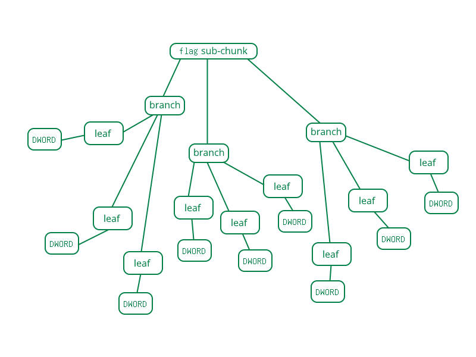

# Section 6: SFe enumerations and feature flags

## 6.1 About SFe enumerations

SFe 4.0 enumerations are identical to legacy SF2.04, but more enumerations may be defined in the future.

Once the enumeration model is changed significantly, we will list all changed modulator and generator enums with a clear explanation of what they do. Equations for timecents will also be included!

## 6.2 Feature flags

### 6.2.1 Feature flag tree structure

The feature flags system is split like this:

- Branches: Roughly corresponds to each version (but not all listed features are part of the version). Maximum of 256. Number may increase with later `wMajor` versions.
- Leaves: Corresponds to each feature. Maximum of 256. These may change with later `wMajor` versions. Contains 32-bit data declaring how much of the feature is implemented.
- Flags: Each of the 32 bits that comprise a leaf, declaring support for specific features.

Feature flags listed as "reserved" must not be used for private use. Branches 240 (`F0`) to 255 (`FF`) are provided for such use.

Figure 12: The tree structure of the feature flags system.

### 6.2.2 Branch 00 Foundational synthesis engine

#### 00:00 Tuning

- Bit 1: Coarse tuning
- Bit 2: Fine-tuning
- Bit 3: Root key
- Bit 4: Scale tuning

#### 00:01 Looping

- Bit 1: Loop during release
- Bit 2: Non-loop during release

#### 00:02 Filter Types

- Bit 1: Sound Blaster compatible low pass (12dB filter)

#### 00:03 Filter Parameters

- Bits 1-16: Maximum supported filter frequency/cutoff
- Bits 17-24: Maximum supported filter resonance
- Bits 25-32: Reserved

#### 00:04 Amplification and attenuation

- Bit 1: Attenuation supported in preset (0.4x)
- Bit 2: Attenuation supported in instrument (0.4x)
- Bit 3: Amplification supported in preset (0.4x)
- Bit 4: Reserved
- Bit 5: Reserved
- Bit 6: Reserved
- Bit 7: Reserved

#### 00:05 Effects blocks

- Bit 1: Instrument-level reverb
- Bit 2: CC91 reverb
- Bit 3: Combined reverb
- Bit 4: Adjustable reverb
- Bit 9: Instrument-level chorus
- Bit 10: CC93 chorus
- Bit 11: Combined chorus
- Bit 12: Adjustable chorus
- Bit 17: Pan supported

#### 00:06 Low Frequency Oscillators

- Bit 1: Vibrato supported
- Bit 2: Pitch Modulation
- Bit 3: Filter Modulation
- Bit 4: Amplitude Modulation

#### 00:07 Envelopes

- Bit 1: Volume delay
- Bit 2: Volume attack
- Bit 3: Volume hold
- Bit 4: Volume decay
- Bit 5: Volume sustain
- Bit 6: Volume release
- Bit 7: Key to volume hold
- Bit 8: Key to volume decay
- Bit 9: Modulation delay
- Bit 10: Modulation attack
- Bit 11: Modulation hold
- Bit 12: Modulation decay
- Bit 13: Modulation sustain
- Bit 14: Modulation release
- Bit 15: Key to modulation hold
- Bit 16: Key to modulation decay
- Bit 17: Modulation of volume
- Bit 18: Modulation of pitch
- Bit 19: Modulation of filter

#### 00:08 MIDI Control Changes

- Bit 1: 00 Bank Select MSB
- Bit 2: 00 Bank Select MSB for percussion
- Bit 3: 06 Data Entry MSB
- Bit 4: 32 Bank Select LSB (Multiple banks)
- Bit 5: 32 Bank Select LSB (Preset name)
- Bit 6: 32 Bank Select LSB (`byBankLSB` support)
- Bit 7: 32 Bank Select LSB for percussion
- Bit 8: 38 Data Entry LSB
- Bit 9: 64 Sustain
- Bit 10: 66 Soft
- Bit 11: 67 Sostenuto
- Bit 12: 98 NRPN LSB
- Bit 13: 99 NRPN MSB
- Bit 14: 100 RPN LSB
- Bit 15: 101 RPN MSB
- Bit 16: 120 All sound off
- Bit 17: 121 Reset all controllers
- Bit 18: 123 All notes off
- Bit 19: Reserved

#### 00:09 Generators

- Bit 1: Index gen support
- Bit 2: Range gen support
- Bit 3: Substitution gen support
- Bit 4: Sample gen support
- Bit 5: Value gen support
- Bit 6: PGEN support
- Bit 7: IGEN support

#### 00:0a Zones

- Bit 1: Key range
- Bit 2: Velocity range
- Bit 3: Exclusive class
- Bit 4: Fixed key
- Bit 5: Fixed velocity
- Bit 6: Sample offset
- Bit 7: Loop offset

#### 00:0b Reserved

- Bit 1: Reserved
- Bit 2: Reserved
- Bit 3: Reserved
- Bit 4: Reserved

### 6.2.3 Branch 01 Modulators and NRPN

#### 01:00 Modulators

- Bit 1: Primary source
- Bit 2: Secondary source
- Bit 3: Transform support
- Bit 4: Linear curves
- Bit 5: Concave curves
- Bit 6: Convex curves
- Bit 7: Switch curves
- Bit 8: Positive unipolar
- Bit 9: Negative unipolar
- Bit 10: Positive bipolar
- Bit 11: Negative bipolar
- Bit 12: Modulator chaining
- Bit 13: PMOD support
- Bit 14: IMOD support

#### 01:01 Modulation controllers

- Bit 1: Note-on velocity
- Bit 2: Note-on key number
- Bit 3: Poly pressure
- Bit 4: Channel pressure
- Bit 5: Pitch wheel
- Bit 6: Pitch wheel sensitivity

#### 01:02 Modulation parameters 1

- Bits 1-32: MIDI CC000-031

#### 01:03 Modulation parameters 2

- Bits 1-32: MIDI CC064-095

#### 01:04 Modulation parameters 3

- Bits 1-32: MIDI CC096-127

#### 01:05 NRPN

- Bit 1: NRPN select MSB=120
- Bit 2: NRPN select LSB: 1-2 digits
- Bit 3: NRPN select LSB: 3 digits
- Bit 4: NRPN select LSB: 4 digits
- Bit 5: NRPN select LSB: 5 digits

#### 01:06 Default modulators (Update 21)

- Bit 1: MIDI note on to initial attenuation
- Bit 2: MIDI note on to filter cutoff
- Bit 3: MIDI channel pressure to vibrato LFO pitch depth
- Bit 4: MIDI CC1 to vibrato LFO pitch depth
- Bit 5: MIDI CC7 to initial attenuation
- Bit 6: MIDI CC10 to pan position
- Bit 7: MIDI CC11 to initial attenuation
- Bit 8: MIDI CC91 to reverb send
- Bit 9: MIDI CC93 to chorus send
- Bit 10: MIDI pitch wheel to initial pitch, controlled by pitch wheel sensitivity
- Bit 11: MIDI poly pressure to vibrato LFO pitch depth
- Bit 12: MIDI CC92 to modulator LFO volume depth
- Bit 13: MIDI CC73 to volume envelope attack
- Bit 14: MIDI CC72 to volume envelope release
- Bit 15: MIDI CC74 to initial filter cutoff
- Bit 16: MIDI CC71 to initial filter resonance
- Bit 17: MIDI note on to filter cutoff (SF2.00)
- Bit 18: MIDI note on to filter cutoff (SF2.01)
- Bit 19: MIDI note on to filter cutoff (SF2.04)
- Bit 20: Reserved
- Bit 21: Reserved
- Bit 24 off, bit 25 off: DMOD not supported
- Bit 24 on, bit 25 off: DMOD read support only
- Bit 24 on, bit 25 on: DMOD playback support

#### 01:07 Reserved

- Bit 1 off, bit 2 off: Reserved
- Bit 1 on, bit 2 off: Reserved
- Bit 1 on, bit 2 on: Reserved
- Bit 3: Reserved
- Bit 4: Reserved
- Bit 5: Reserved
- Bit 6: Reserved

#### 01:08 Reserved

- Bit 1: Reserved
- Bit 2: Reserved
- Bit 3: Reserved
- Bit 4: Reserved
- Bit 5: Reserved

### 6.2.4 Branch 02 Sample bitdepth support

#### 02:00 24-bit support

- Bit 1 off, bit 2 off: No support
- Bit 1 on, bit 2 off: Read support only
- Bit 1 on, bit 2 on: Playback support

#### 02:01 8-bit support

- Bit 1 off, bit 2 off: No support
- Bit 1 on, bit 2 off: Read support only
- Bit 1 on, bit 2 on: Playback support

#### 02:02 32-bit support

- Bit 1 off, bit 2 off: No support
- Bit 1 on, bit 2 off: Read support only
- Bit 1 on, bit 2 on: Playback support

#### 02:03 64-bit support

- Bit 1 off, bit 2 off: No support
- Bit 1 on, bit 2 off: Read support only
- Bit 1 on, bit 2 on: Playback support

### 6.2.5 Branch 03 SFe Compression support

#### 03:00 Compression flag

- 0: sfSampleType bit 4 unsupported
- 1: sfSampleType bit 4 supported

#### 03:01 Sample compression formats

- Bit 1: OGG
- Bit 2: Opus
- Bit 3: FLAC
- Bit 4: WAV (containerised)

### 6.2.6 Branch 04 Metadata upgrades

#### 04:00 Metadata improvements

- Bit 1: UTF-8 in INFO
- Bit 2: UTF-8 in pdta

#### 04:01 Reserved

- Bit 1: Reserved
- Bit 2: Reserved
- Bit 3: Reserved

#### 04:02 User-defined sample ROMs

- Bit 1: Support for user-defined sample ROMs

#### 04:03 ROM emulator

- Bit 1: 1MB ROM emulator support

#### 04:04 Reserved

- Bit 1: Reserved